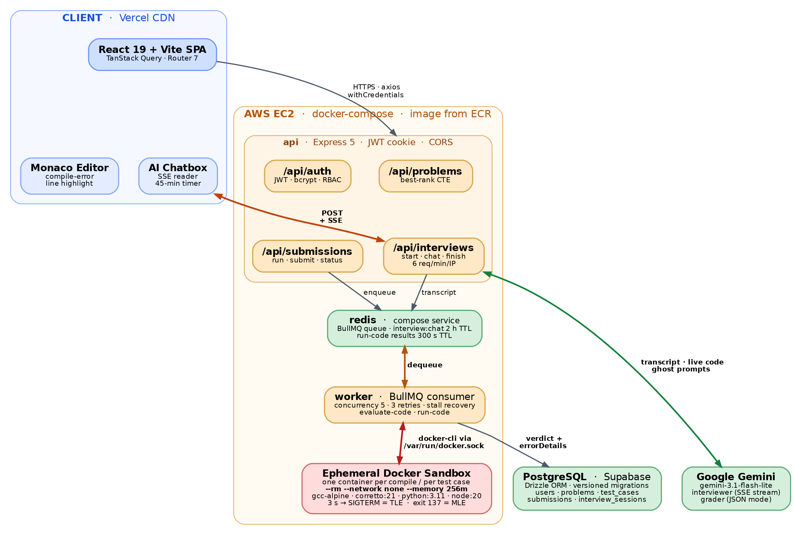

# **Ascend: The Next Generation Interviewer — High-Level Design (HLD)**

*Version 2.0 — AI Interviewer Integration, updated with session resilience (server-authoritative timer, resumable sessions on reload including the candidate's chat history and code editor state), adaptive interview pacing, per-language editor persistence (switching languages no longer discards progress in the one you're leaving), and an expanded, evidence-based AI grading rubric (§5.6). This document supersedes the V1 HLD and describes the system as it is currently deployed.*

## **0\. High-Level Architecture Diagram**



The diagram reads top to bottom as a request flows through the system. The **React client** on Vercel reaches the **Express API** over credentialed HTTPS, except for the interview conversation, which is a POST that stays open as a Server-Sent Events stream (the orange path). Anything that executes code is never run inline: `/api/submissions` and `/api/interviews` both write to **Redis**, which serves simultaneously as the BullMQ queue, the live interview transcript and editor-state store, and the run-result cache. The **worker** dequeues and drives the **ephemeral Docker sandboxes** through the host's Docker socket — the red path, and the only place in the system where untrusted code executes.

Two boundaries are worth reading carefully. Everything inside the **AWS EC2** box is a `docker-compose` service on a single instance, including Redis — only PostgreSQL and Gemini are genuinely external. And the sandbox is the sole component reached via `/var/run/docker.sock`; the API container has no access to the Docker daemon at all.

*Source: `architecture.dot` (Graphviz). Regenerate with `dot -Tpng -Gdpi=200 architecture.dot -o architecture.png`.*

## **1\. Tech Stack**

* **Frontend:** React 19 \+ Vite 8, TanStack Query (server-state management and caching), React Router 7, React Hook Form, Tailwind CSS 4\.  
* **Code Editor:** Monaco Editor (`@monaco-editor/react`), with `react-markdown`, `remark-math` and `rehype-katex` for rendering problem statements and AI messages.  
* **Backend:** Node.js 18+ \+ Express 5 (native ES Modules).  
* **ORM & Migrations:** Drizzle ORM \+ `drizzle-kit` (versioned SQL migrations checked into the repository).  
* **Database:** PostgreSQL, hosted on Supabase (relational schema enforcing ACID compliance).  
* **Cache & Message Broker:** Redis \+ BullMQ via `ioredis` (asynchronous job queuing, live interview state, and run-result caching).  
* **Execution Sandbox:** Docker — one throwaway container per compilation step and one per test case execution.  
* **AI Layer:** Google Gemini (`gemini-3.1-flash-lite`) through the `@google/generative-ai` SDK, used for both the live interviewer and the post-interview grader.  
* **Real-Time Transport:** Server-Sent Events (SSE) streamed over an authenticated HTTP POST, consumed on the client via the Fetch `ReadableStream` API.

## **2\. Database Schema (PostgreSQL)**

### **2.1. Tables**

### **2.1.1. Users Table**

Handles authentication, user profiles, and role-based access (RBAC).

| Column Name | Data Type | Constraints & Keys |
| :---- | :---- | :---- |
| user\_id | UUID | **Primary Key**, Default `gen_random_uuid()` |
| username | VARCHAR(255) | Unique, Not Null |
| email\_id | VARCHAR(255) | Unique, Not Null |
| hashed\_password | VARCHAR(255) | Not Null (bcrypt, 10 salt rounds) |
| role | ENUM `role` | Enum: 'ADMIN', 'USER' (Default: 'USER'), Not Null |
| created\_at | TIMESTAMP | Default `now()`, Not Null |

### **2.1.2. Problems Table**

Stores the core problem data, the UI-facing sample cases, and the constraints block that the AI interviewer withholds until the candidate earns it.

| Column Name | Data Type | Constraints & Keys |
| :---- | :---- | :---- |
| problem\_id | UUID | **Primary Key**, Default `gen_random_uuid()` |
| problem\_name | VARCHAR(255) | Unique, Not Null |
| difficulty | ENUM `difficulty` | Enum: Easy, Medium, Hard — Not Null |
| statement | TEXT | Not Null |
| constraints | TEXT | Nullable — *added in V2* |
| sample\_test\_cases | JSONB | Not Null |

### **2.1.3. Test Cases Table**

Stores the hidden test cases for the execution engine.

| Column Name | Data Type | Constraints & Keys |
| :---- | :---- | :---- |
| test\_case\_id | UUID | **Primary Key**, Default `gen_random_uuid()` |
| problem\_id | UUID | **Foreign Key** — Problems(problem\_id), **ON DELETE CASCADE**, Not Null |
| input | TEXT | Not Null |
| output | TEXT | Not Null |

### **2.1.4. Submissions Table**

Tracks all code executions, historical data, verdicts, and — new in V2 — the AI's score for the interview attempt that produced the submission.

| Column Name | Data Type | Constraints & Keys |
| :---- | :---- | :---- |
| submission\_id | UUID | **Primary Key**, Default `gen_random_uuid()` |
| user\_id | UUID | **Foreign Key** — Users(user\_id), Not Null |
| problem\_id | UUID | **Foreign Key** — Problems(problem\_id), Not Null |
| session\_id | UUID | **Foreign Key** — Interview Sessions(session\_id), Nullable — *added in V2* |
| code | TEXT | Not Null |
| language | ENUM `language` | Enum: c, cpp, java, python, javascript — Not Null |
| verdict | ENUM `verdict` | Enum: Pending, Accepted, Compilation Error, Runtime Error, Time Limit Exceeded, Memory Limit Exceeded, Wrong Answer, Internal System Error (Default: 'Pending'), Not Null |
| created\_at | TIMESTAMP | Default `now()`, Not Null |
| error\_details | JSONB | Nullable — failing test case ID, expected vs. actual output, or the raw compiler trace |
| total\_score | INTEGER | Default 0, Not Null — *added in V2* |
| gamified\_rank | VARCHAR(15) | Default 'Unranked', Not Null — *added in V2* |
| score\_breakdown | JSONB | Default `{}`, Not Null — *added in V2* |

### **2.1.5. Interview Sessions Table**

New in V2. A dedicated table for mock interview sessions, deliberately kept separate from `submissions` so that the core judging table is never polluted with conversational data.

| Column Name | Data Type | Constraints & Keys |
| :---- | :---- | :---- |
| session\_id | UUID | **Primary Key**, Default `gen_random_uuid()` |
| user\_id | UUID | **Foreign Key** — Users(user\_id), Not Null |
| problem\_id | UUID | **Foreign Key** — Problems(problem\_id), Not Null |
| submission\_id | UUID | **Foreign Key** — Submissions(submission\_id), Nullable |
| chat\_history | JSONB | Default `'[]'` — the archived transcript, flushed from Redis when the interview ends |
| started\_at | TIMESTAMP | Default `now()`, Not Null |
| ended\_at | TIMESTAMP | Nullable — remains NULL until the session is graded |

### **2.2 Entity Relationships**

* **Users to Submissions** \- One-to-many: A single user can make multiple submissions, but each submission belongs to exactly one user.  
* **Problems to Submissions** \- One-to-many: A single problem can have multiple submissions across different users.  
* **Problems to Test Cases** \- One-to-many: A single problem contains multiple hidden test cases, and deleting the problem cascades the deletion of its test cases.  
* **Users to Interview Sessions** \- One-to-many: A single user can attempt many mock interviews.  
* **Interview Sessions to Submissions** \- One-to-many: Every "Submit" pressed inside an active interview stamps its `session_id` onto the submission, so the entire attempt can be reconstructed afterwards.  
* **Interview Sessions to Final Submission** \- One-to-one (nullable): `interview_sessions.submission_id` points at the single graded snapshot for that session. This forms a deliberate circular reference with `submissions.session_id`; both sides are nullable, so rows can always be inserted in either order.

### **2.3 Database Indexes**

1. **Submissions (user\_id, problem\_id):** A composite index that heavily optimizes the `GET /api/submissions/problem/:problemId/me` endpoint to instantly fetch a specific user's history for the exact problem they are currently viewing.  
2. **Submissions (user\_id):** Optimizes querying a single user's entire history, powering the `GET /api/submissions/me` endpoint.  
3. **Submissions (problem\_id):** Optimizes the `GET /api/submissions/problem/:problemId/all` endpoint to fetch all attempts across the platform for a specific problem.  
4. **Submissions (created\_at):** Optimizes sorting for recent submissions and serves as the tie-breaker column in leaderboard aggregations.  
5. **Submissions (problem\_id, total\_score DESC):** *New in V2.* A composite index purpose-built for the gamified leaderboard, which sorts by AI score descending within a single problem.  
6. **Test Cases (problem\_id):** Ensures the Worker instantly retrieves all hidden test cases when evaluating a fresh submission.  
7. **Problems (difficulty):** Optimizes difficulty filtering on the dashboard.  
8. **Interview Sessions (user\_id), (problem\_id), (user\_id, problem\_id), (submission\_id):** *New in V2.* Support the ownership check performed on every chat and grading request, plus per-user interview history lookups.

## **3\. Backend REST API Endpoints (Express.js)**

Every route below is authenticated except the health check and the two public auth entry points. Authentication is performed by the `requireAuth` middleware, which reads the JWT from an HTTP-only cookie.

### **3.1 Authentication**

| Endpoint | HTTP Method | Purpose   |
| :---- | :---- | :---- |
| /api/auth/register | POST | Create a new user, hash the password with bcrypt, and set the JWT cookie. |
| /api/auth/login | POST | Authenticate a user and set the JWT cookie. |
| /api/auth/logout | POST | Log the user out by clearing the HTTP-only cookie. |
| /api/auth/verify | GET | Validate the cookie and return the decoded user payload. Backs the frontend's `ProtectedRoute` guard. |

### **3.2 Problems**

| Endpoint | HTTP Method | Purpose   |
| :---- | :---- | :---- |
| /api/problems/user-status | GET | Fetch every problem for the dashboard, LEFT JOINed against a window-function CTE that resolves the current user's **best rank** for each problem. |
| /api/problems/:id | GET | Fetch a specific problem's statement, constraints, and sample test cases for the Coding Arena. |
| /api/problems | POST | **Admin only.** Create a problem and bulk-insert its hidden test cases inside a single database transaction. |
| /api/problems/:id | DELETE | **Admin only.** Delete a problem; its hidden test cases are removed by the ON DELETE CASCADE constraint. |

### **3.3 Submissions & Execution**

| Endpoint | HTTP Method | Purpose   |
| :---- | :---- | :---- |
| /api/submissions/run | POST | Queue a scratch execution against custom stdin. Returns a UUID `jobId`. Never touches the database or the leaderboard. |
| /api/submissions/run/:id/status | GET | Poll the Redis cache for the result of a `run-code` job. Returns **202 Accepted** while the job is still in flight. |
| /api/submissions/submit | POST | Official evaluation against hidden test cases. Persists the submission as *Pending* and enqueues an `evaluate-code` job. Accepts an optional `sessionId` binding the submission to a live interview. |
| /api/submissions/:id/status | GET | **Polling endpoint.** Fetches the current verdict and error details for a specific submission without a full page refresh. |
| /api/submissions/me | GET | Fetch the complete submission history for the logged-in user across every problem they have attempted. |
| /api/submissions/problem/:problemId/me | GET | Fetch the logged-in user's submissions for a specific problem. Populates the "My Submissions" tab. |
| /api/submissions/problem/:problemId/all | GET | Fetch all users' submissions for a specific problem. Populates the "All Submissions" tab. |
| /api/submissions/leaderboard/problem/:problemId | GET | Fetch the gamified tier list for a problem. Joins on users, filters to **Accepted** verdicts, sorts by `total_score` DESC with `created_at` ASC as the tie-breaker, then de-duplicates down to each user's single best attempt. |

### **3.4 AI Interviews**

| Endpoint | HTTP Method | Purpose   |
| :---- | :---- | :---- |
| /api/interviews/start | POST | Resume an existing unfinished session for this user + problem if one exists — returning its `sessionId`, `startedAt`, saved chat transcript, and saved editor state (§5.1) — otherwise create a new `interview_sessions` row. Rate limited. |
| /api/interviews/chat | POST | **Server-Sent Events stream.** Appends the candidate's message to the Redis transcript, calls Gemini with the full history plus the live editor contents, and streams the reply back token-by-token. Rate limited. |
| /api/interviews/code | POST | Autosaves the candidate's live editor contents to Redis on a debounce, keyed **per language** plus the active language (`codeByLanguage`, §6.3), so a reload restores what they were typing in every language they'd touched — and switching the language dropdown mid-session never discards it either. Not rate limited — it's a cheap cache write, not an AI call. |
| /api/interviews/finish | POST | Snapshot the final code, guarantee that a graded verdict exists, run the AI grader, map the score to a rank, and atomically persist everything. Rate limited. |

### **3.5 System**

| Endpoint | HTTP Method | Purpose   |
| :---- | :---- | :---- |
| / | GET | Health check. Returns `{ status: "OK" }` for uptime probes and load balancer checks. |

## **4\. Execution Engine & Pipeline**

### **4.1 Supported Languages & Sandbox Images**

| Language | Docker Image | Compile / Syntax Step | Run Command |
| :---- | :---- | :---- | :---- |
| c | gcc-alpine | `gcc -fsanitize=address,undefined -fno-sanitize-recover=all -g -Wall -Werror` | `/app/main` |
| cpp | gcc-alpine | `g++ -fsanitize=address,undefined -fno-sanitize-recover=all -g -Wall -Werror` | `/app/main` |
| java | amazoncorretto:21-alpine | `javac -Xlint:all -Werror` | `java Main` |
| python | python:3.11-slim | `python -m py_compile` | `python -W error` |
| javascript | node:20-alpine | `node -c` | `node --use_strict --throw-deprecation` |

Four of the five images are pulled unmodified from Docker Hub. The `gcc-alpine` image is built locally from a deliberately minimal `Dockerfile.gcc` — the smaller the sandbox image, the smaller the attack surface and the faster the cold start:

```dockerfile
# Start with the tiny 5MB Alpine Linux OS
FROM alpine:latest

# Install only the C compiler, C++ compiler, and standard math/C libraries
RUN apk add --no-cache gcc g++ musl-dev
```

**Sanitizer-backed correctness.** C and C++ submissions are compiled with **AddressSanitizer** and **UndefinedBehaviorSanitizer** in non-recovering mode. Out-of-bounds writes, use-after-free, signed integer overflow and similar latent bugs abort the process immediately and are reported as a **Runtime Error** rather than silently producing a wrong answer. The interpreted languages are held to an equivalent standard by promoting warnings to errors (`-W error`, `--throw-deprecation`, `-Werror`).

### **4.2 Sequential Evaluation Pipeline (Submit Route)**

1. **Queue Pickup:** The BullMQ worker picks up an `evaluate-code` job for a *Pending* submission.  
2. **Workspace Isolation:** A UUID-named temporary directory is created and the source file is written into it. The worker writes through its own container path (`/app/temp/<uuid>`) while mounting the equivalent **host** path (`/home/ubuntu/app/temp/<uuid>`) into the sandbox — the worker drives the host Docker daemon, so the bind-mount source must always be expressed in host coordinates.  
3. **Compilation:** A throwaway container compiles or syntax-checks the source under a 10-second ceiling. Failure short-circuits the pipeline with a **Compilation Error** verdict and the raw compiler `stderr` preserved in `error_details`.  
4. **Sequential Streaming:** The worker fetches every hidden test case for the problem and iterates through them. Each test case runs in a fresh container started with `--rm --network none --memory 256m --memory-swap 256m`, with stdin redirected from a file written into the mounted workspace. The failure branch is classified by inspecting *how* the process died:  
   * If the wall clock exceeds 3 seconds, `exec` sends SIGTERM: **"Time Limit Exceeded"** (TLE).  
   * If the kernel's OOM killer terminates the container for breaching the cgroup ceiling, Docker reports exit code **137** (128 \+ SIGKILL): **"Memory Limit Exceeded"** (MLE). Because the sandbox runs with `--network none` and nothing else on the host targets these containers, a 137 is unambiguously an OOM kill.  
   * If the process aborts, segfaults, trips a sanitizer, or exits non-zero for any other reason: **"Runtime Error"** (RTE), with the trace preserved.  
   * If stdout does not match the expected output: **"Wrong Answer"** (WA), recording the failing input, the expected output and the actual output.  
5. **Final Verdict:** If the loop completes without breaking, the database is updated to **"Accepted"**. Every container is destroyed by `--rm`, and the temporary directory is removed in a `finally` block regardless of outcome.

### **4.3 The Run Pipeline (Scratch Execution)**

The `run-code` job follows the same compile-then-execute path but against a single user-supplied stdin. It never writes to PostgreSQL. The result is cached in Redis under the job's UUID with a **300-second TTL**, and the frontend polls `GET /api/submissions/run/:id/status` until it materializes. This keeps the judging table free of exploratory noise while still giving the AI interviewer visibility into what the candidate is trying (see §5.3).

### **4.4 Queue Configuration**

* **Concurrency:** 5 jobs in flight per worker process.  
* **Lock duration:** 30 seconds — the worker must renew its lock to prove liveness.  
* **Retries:** 3 attempts with exponential backoff starting at 1 second.  
* **Stalled jobs:** `maxStalledCount: 3` before the job is declared dead.  
* **Retention:** the last 1,000 completed jobs are kept for up to 24 hours for auditing, then evicted.

## **5\. AI Interview Engine**

This is the defining addition of V2. The Coding Arena is no longer a solitary editor — it is a conversational interview with a stateful examiner.

**Input mode.** The entire interview — problem discussion, approach explanation, follow-ups — happens through typed chat (§5.4). There is no speech-to-text or text-to-speech in this version; the candidate types and the interviewer replies with streamed text. This is a deliberate scope cut for V2, not an oversight, and it means the current system does not exercise verbal communication the way an in-person or phone interview would — closing that gap is tracked as Voice Interviews in the V3 roadmap (§11).

### **5.1 Session Lifecycle**

1. **Start (with resume).** The candidate opens a problem and the frontend calls `POST /api/interviews/start` on mount. The server first looks for an existing, unfinished session (`ended_at IS NULL`) for that user and problem. If one exists and is younger than the 45-minute session length plus a 5-minute grace window, it is handed back as-is — `sessionId`, `startedAt`, the archived Redis transcript, and the last autosaved editor state (a `codeByLanguage` map plus the active language, see step 2) — so a page reload or a dropped connection resumes exactly where the candidate left off, code in every language they'd touched included, instead of silently starting over. Otherwise a fresh row is inserted into `interview_sessions` with `ended_at` NULL. A session past the grace window is closed out server-side (`ended_at` set, Redis caches cleared) before a new one is created, so an abandoned tab can never permanently block a candidate from starting again.  
2. **Live phase.** Every chat turn hits `POST /api/interviews/chat`. The server verifies that the session belongs to the requesting user *and* the requested problem before touching the LLM. Each message appended to the Redis transcript is stamped with a `createdAt` timestamp and an `isGhost` flag (§5.3), which together drive both session-pacing awareness (§5.2) and faithful UI hydration on resume. The transcript lives in Redis under `interview:chat:<sessionId>` with a **2-hour TTL**, so a truly abandoned interview still evicts itself from memory automatically. Independently, the Monaco editor's contents are autosaved to Redis on a debounce via `POST /api/interviews/code` — under `interview:code:<sessionId>`, same 2-hour TTL, storing `{ codeByLanguage, language }` rather than a single code+language pair — so the candidate's code survives a reload the same way the chat transcript does, in every language, not just whichever one was active when they left (§6.3).  
3. **Finish.** Triggered either by the 45-minute timer expiring or by the candidate pressing "End Interview". The server snapshots the code, grades the transcript, persists the result, and deletes both Redis keys.

### **5.2 The Interviewer: A Prompt-Enforced State Machine**

The system instruction sent to Gemini defines a strict six-phase progression, and the model is explicitly forbidden from revealing the phases or writing a full solution:

* **Phase 0 — Greeting & Setup:** Welcome the candidate and wait for confirmation.  
* **Phase 1 — Problem Reveal & Discovery:** Release the statement *only*. Sample test cases are provided on request; constraints are withheld unless explicitly asked for.  
* **Phase 2 — Approach & Brainstorming:** Demand a plain-English approach before any code. A wrong approach earns a failing test case to dry-run against, never the answer.  
* **Phase 3 — Complexity & Optimization:** Require Time and Space Complexity. A brute-force answer triggers the constraint reveal and a push to optimize; Phases 2 and 3 cycle until the approach is optimal.  
* **Phase 4 — Coding:** The editor is explicitly unlocked. System-injected observations about idleness surface as gentle hint offers.  
* **Phase 5 — Submission & Follow-ups:** An Accepted verdict earns one or two theoretical follow-ups (scale, concurrency, problem variants) before the interview is allowed to close.

Each turn is sent with the problem record, the **live contents of the Monaco editor**, and the full Redis transcript, so the interviewer can see the candidate's code as it is being written.

**Pacing awareness.** Alongside the phase rules, every system prompt carries a live *Session Pacing* block: minutes elapsed and remaining against the 45-minute session (derived from the session's `started_at`), and the gap since the candidate's last message (derived from consecutive `createdAt` timestamps in the transcript). The model is instructed to use this to adapt rather than to follow a fixed script — going deeper when time is abundant and the candidate is moving well, accelerating hints and constraint reveals when time is short and the candidate hasn't started coding yet, and treating an unusually long gap since the last message as a possible sign of being stuck. It is explicitly told never to surface these numbers or acknowledge that it is tracking time.

### **5.3 The Hybrid "Ghost Prompt" Architecture**

The interviewer is fed machine-generated observations that the candidate never sees. These are appended to the outgoing message as a bracketed `[SYSTEM OBSERVATION]` block that the model is instructed never to echo verbatim. Four triggers are wired up:

* **Idle detection:** No keystroke in the editor or the chat for 5 minutes prompts the AI to ask whether the candidate is stuck.  
* **Run succeeded:** The custom input and the produced output are handed to the AI, which silently verifies correctness and intervenes *only* if the output is wrong.  
* **Run crashed:** The compiler or runtime trace is forwarded so the AI can point at the conceptual mistake without writing the fix.  
* **Submit returned:** An **Accepted** verdict triggers a follow-up question; a **Wrong Answer** hands over the failing input and the expected-versus-actual outputs so the AI can nudge toward the missed edge case.

This is what makes the session feel supervised rather than merely transcribed: the AI reacts to what the candidate *does*, not only to what they say.

Ghost/system-observation turns are also flagged with `isGhost: true` in the stored transcript, alongside the initial silent kickoff message that opens every session. This keeps them available to the AI (and to the grader) as context, while excluding them from what gets replayed into the chat UI when a session is resumed (§5.1) — a candidate resuming mid-interview only ever sees their own real turns and the interviewer's real replies.

### **5.4 Transport: Server-Sent Events**

The chat endpoint responds with `Content-Type: text/event-stream`. Gemini's streamed chunks are relayed as `data: {"text":"..."}\n\n` frames and terminated with a `data: [DONE]` sentinel; each chunk is JSON-encoded so that newlines inside the model's prose cannot corrupt the SSE framing. The frontend consumes this with `fetch` and a `ReadableStream` reader rather than `EventSource`, because the request must be a **POST carrying credentials** — something `EventSource` cannot express. Errors raised mid-stream are emitted as an in-band error frame followed by `[DONE]`, so the client always terminates cleanly.

### **5.5 The Smart Snapshot**

A candidate may end an interview having just pressed Submit, or having typed twenty more characters afterwards, or having never submitted at all. `POST /api/interviews/finish` resolves all three cases before grading:

* It fetches the most recent submission carrying this `session_id`.  
* If the trimmed final code is **identical** to that submission, the existing row is reused — preserving the real *Accepted* or *Wrong Answer* verdict the candidate earned.  
* Otherwise a new submission is inserted, pushed onto the evaluation queue, and the request **blocks on a verdict poll** (20 attempts at 1-second intervals) so that no interview is ever graded against unjudged code.

### **5.6 The Grading Engine**

The archived transcript and the final code are sent to Gemini in **JSON mode** (`responseMimeType: application/json`) with a 100-point, four-pillar rubric:

| Pillar | Points | What it measures |
| :---- | :---- | :---- |
| Data Structures & Algorithms | 25 | Optimality of the approach and correctness of the Big-O analysis — **time and space are graded as two distinct sub-scores**, and both can be credited from a clearly-articulated verbal approach even if it was never coded. |
| Code Quality & Edge Cases | 25 | Readability, formatting, and explicit handling of edge cases. Requires actual code — scores 0/25 if `finalCode` is empty, blank, or template-only. |
| Communication & Discovery | 25 | Whether constraints and edge cases were probed **before** coding, and whether logic was dry-run aloud. Graded entirely from the transcript, so it is fully scoreable even with no code. |
| Problem Solving & Speed | 25 | Independence (every hint costs points), follow-up accuracy, and time to Accepted. The "time to Accepted" sub-component scores 0 with no code, but hint-independence and follow-up handling are still graded from the transcript. |

**Grace credit instead of a flat floor.** Earlier versions hard-floored `total_score` to 0 whenever `finalCode` was empty or template-only, regardless of what happened in the conversation — which meant a candidate who correctly talked through an optimal approach, nailed the complexity analysis, and asked sharp clarifying questions, but simply ran out of time before typing anything, scored identically to someone who never engaged at all. The rubric now zeroes out only the pillars/sub-components that genuinely require code (Code Quality & Edge Cases, and the speed-to-Accepted portion of Problem Solving & Speed); the Data Structures & Algorithms and Communication & Discovery pillars — plus hint-independence and follow-up handling — are still graded honestly from the transcript. In practice this means a strong verbal-only performance lands non-zero, while a session with weak or absent engagement still lands near 0. The grader is explicitly instructed not to let a low `total_score` "bleed into" unrelated per-metric tags (e.g. still tagging `askedConstraints` as excellent even though `codeQuality` is "No Code Submitted").

The model returns `total_score`, a `summary`, `strengths`, `weaknesses`, and a `metrics` object. That object now carries ten tags, each drawn from an exhaustive, evidence-required enum rather than the original three-to-four-value scales.

The response is still validated for its required keys before it is trusted; a malformed or incomplete payload fails the request rather than writing garbage into the database.

### **5.7 Gamified Ranking**

The numerical score is mapped to a tier, and both are persisted:

| Score Range | Rank |
| :---- | :---- |
| 90–100 | S-rank |
| 80–89 | A-rank |
| 70–79 | B-rank |
| 60–69 | C-rank |
| 50–59 | D-rank |
| 0–49 | E-rank |

The UI surfaces only the tier, preserving the immersive framing. The raw `total_score` stays in the database and is used solely as the primary sort key — and precise tie-breaker — on the per-problem leaderboard. Ranks are **per attempt**, not global: each coding session is evaluated independently, and the dashboard surfaces a user's best rank per problem.

### **5.8 Atomic Persistence**

The final write is wrapped in a single database transaction: the submission receives its `total_score`, `gamified_rank` and `score_breakdown`, and the interview session receives its archived `chat_history` and `ended_at` timestamp. Either both land or neither does. Only after the transaction commits is the Redis transcript deleted.

## **6\. Frontend State & UI Flow**

### **6.1 UI Screens**

* **Page 1: Authentication Space** (`/login`, `/register`) — React Hook Form validation, JWT cookie set on success.  
* **Page 2: Dashboard** (`/dashboard`) — the problem list, each row annotated with the user's **best gamified rank** for that problem, served by the window-function CTE behind `/api/problems/user-status`. A **Logout** action calls `POST /api/auth/logout`, clears the cached `authUser` query, and redirects to `/login`.  
* **Page 3: Coding Arena** (`/problems/:id`) — a split layout: Monaco editor, language selector, custom-input panel and terminal on one side; the AI chat interface (text-only — typed input, streamed text replies; no voice) and the live countdown on the other. *Run Code* and *Submit Code* remain, now wired into the ghost-prompt pipeline and into an in-editor error-line highlight for compilation failures (§6.6).  
* **Page 4: Submissions & Leaderboard** (`/problems/:id/submissions`) — two tabs: My Submissions and the rank-ordered Leaderboard.

All application routes sit behind a `ProtectedRoute` wrapper that resolves `GET /api/auth/verify` through TanStack Query (`retry: false`, 5-minute `staleTime`), so an expired cookie redirects to login instead of rendering a broken shell.

### **6.2 The Interview Timer**

A 45-minute (2,700-second) countdown drives the session, computed on every tick as `remaining = 2700 - (now - startedAt)` against the session's server-issued `startedAt` rather than a local decrementing counter. This keeps the displayed clock consistent with what the AI interviewer itself is reasoning about (§5.2) and means the countdown survives a page reload instead of resetting to a fresh 45 minutes. It turns red and pulses in the final five minutes, and on reaching zero it fires the grading pipeline automatically — an unattended interview still produces a graded result.

### **6.3 Session Lifetime & Resume**

The `sessionId` lives purely in React state — nothing about the live interview is trusted to browser storage. On mount, the Arena always calls `POST /api/interviews/start`, but the *server* decides whether that returns a brand-new session or resumes an existing one (§5.1): a page refresh, a dropped connection, or an accidental tab close no longer discards progress. On resume, the response's archived transcript rehydrates the chat UI (filtered down to real, candidate-facing turns — see §5.3), its saved editor state rehydrates the per-language code map and the selected language, and its `startedAt` re-anchors the countdown timer (§6.2) — so the Arena reconstructs itself to look exactly as it did before the reload, code in every language included. The authoritative transcript and editor state still live in Redis and the session row in PostgreSQL; a session that goes untouched long enough to exceed the interview length plus a grace window is treated as abandoned and closed out rather than resumed indefinitely, and both Redis caches are still reclaimed by their 2-hour TTL as a backstop.

The session-init effect is guarded against firing twice on mount (a React StrictMode dev-only artifact where effects double-invoke) with a ref flag, mirroring the same pattern `AiChatbox` already used for its own kickoff message — without it, two near-simultaneous `/start` calls could each create a separate `interview_sessions` row, and resume (which picks the most recently *started* session) could end up pointing at whichever one the candidate never actually interacted with.

**Editor autosave, per language.** Arena state keeps a `codeByLanguage` map (language → that language's live editor contents) rather than a single `code` string, and the displayed code is derived as `codeByLanguage[language]`, falling back to a boilerplate template only for a language that has never been touched. Switching the language dropdown only changes which entry of the map is displayed — it no longer overwrites the code, which was a real bug in earlier builds (the dropdown's `onChange` handler used to reset the editor to that language's template unconditionally, silently discarding whatever had been written in the language being left). The whole map plus the active language are debounced 2 seconds after the last change and sent to `POST /api/interviews/code`, independently of chat activity — earlier versions only sent `currentCode` alongside chat turns, which meant a candidate who typed for a while without triggering any chat interaction had nothing to resume. The debounce keeps this to roughly one write every 2 seconds of active typing rather than one per keystroke.

### **6.4 Navigation Guard**

Attempting to leave an active interview raises a modal offering three explicit choices: **Cancel** (stay), **Leave Without Saving** (navigates away; the session is simply never graded), or **End & Save Interview** (runs the full grading flow first). The destructive path is never the default.

### **6.5 Component-Scoped Polling Strategy**

* Both *Run* and *Submit* poll their respective status endpoints once per second, up to 20 attempts, through a shared `poll` helper.  
* Polling is scoped to the Arena component; navigating away unmounts it and clears every interval and idle timer, so no orphaned requests survive the route change.  
* Finished verdicts remain viewable through the Submissions and Leaderboard tabs.

### **6.6 Compile-Error Line Highlighting**

When a Run or Submit resolves to a **Compilation Error** verdict, the frontend does more than print the raw trace in the terminal panel — it locates the offending line inside the Monaco editor and highlights it directly:

* **Per-language extraction.** Each compiler/interpreter emits its own trace format, so a small per-language regex table pulls the 1-based line number out of the raw trace: gcc/g++ (`file:line:col: error:`), javac (`file:line: error:`), and CPython (`File "file", line N`). gcc/g++ and javac prefix the actual error line with a leading context line (e.g. `main.cpp: In function 'int main()':`), so the extraction regex runs with the multiline flag — `^` must anchor to the start of *any* line in the trace, not just the string's absolute start, or the real error line is never reached.  
* **Scoped to compile-time errors only.** Runtime crashes, Time Limit Exceeded, and Memory Limit Exceeded traces are not parsed for a line number — unlike a syntax error, they don't reliably resolve to one originating line — so the highlight is intentionally gated to the `Compilation Error` verdict on both the Run and Submit pipelines.  
* **Monaco decorations.** The resolved line number drives a `deltaDecorations` call: a translucent red background across the whole line plus a red dot in the gutter, and `revealLineInCenter` scrolls the editor to bring the line into view automatically.  
* **Self-clearing.** The highlight is cleared the instant the candidate edits any line, or the next Run/Submit returns a non-compile-error result, so a stale highlight never survives past the code that caused it.

## **7\. Authentication & Authorization**

### **7.1 Role-Based Access Control (RBAC)**

* **Standard User Role:** Can read available problems, start interviews, run and submit code, view their own submission history, and view the global feed and leaderboard for a problem.  
* **Admin Role:** Granted create and delete access over problems and their hidden test cases. The `requireAdmin` middleware runs *after* `requireAuth` and explicitly verifies the `role` claim in the JWT before allowing access; unauthorized attempts are logged with the offending user ID and IP address.

**There is no admin portal.** The registration UI never submits a `role`, so every account created through the web app is a standard `USER`. Elevation is a deliberate out-of-band operation: an administrator is provisioned by calling `POST /api/auth/register` directly from a terminal or an API client with `"role": "ADMIN"` in the request body, and problem authoring is performed the same way — by invoking the admin endpoints directly with that account's cookie. Keeping the privileged surface off the public frontend means the only path to it is one that already requires shell or API-client access. A first-class admin console is listed in the V3 roadmap (§11).

### **7.2 Session Ownership Checks**

RBAC alone does not protect interview data, since every candidate is a standard user. Both `/api/interviews/chat` and `/api/interviews/finish` therefore re-query the session with a three-way predicate — `session_id` **AND** `user_id` **AND** `problem_id` — and return 404 on any mismatch. A leaked or guessed `sessionId` is useless to another account.

## **8\. Non-Functional Requirements (NFRs)**

### **8.1 Resource Constraints on Docker**

* **Memory Limit:** 256 MB per container (`--memory 256m --memory-swap 256m`). Both flags are required: passing `--memory` alone makes Docker silently default the swap ceiling to *twice* the memory value, which would hand a submission 256 MB of RAM plus 256 MB of swap. Setting them equal disables swap for the container and makes the limit a true 256 MB. A breach is detected via exit code 137 and recorded as **Memory Limit Exceeded**.  
* **Execution Time Limit:** 3 seconds wall clock per test case.  
* **Compilation Time Limit:** 10 seconds.  
* **Network:** `--network none` — sandboxes have no network interface whatsoever, eliminating data exfiltration and outbound abuse.  
* **Lifetime:** `--rm` guarantees teardown; the host-side temporary workspace is removed in a `finally` block on every path, including failures.

### **8.2 Security Measures**

### **8.2.1 JWT**

On successful login or registration the backend signs a JWT with a **1-day expiry** and attaches it to an **HTTP-Only Cookie**. This prevents malicious client-side JavaScript (Cross-Site Scripting / XSS) from accessing the token. In production the cookie is issued with `secure: true` and `sameSite: "none"` so it survives the cross-origin hop from the Vercel frontend to the EC2 API; in development it falls back to `sameSite: "lax"` over plain HTTP. The verification middleware distinguishes expired tokens from malformed ones, logging the latter alongside the source IP as a tampering signal.

### **8.2.2 Password Storage**

Passwords are hashed with **bcrypt at 10 salt rounds** and are never returned by any endpoint.

### **8.2.3 CORS**

The API accepts credentialed requests from two kinds of origin: an explicit allowlist — the two production Vercel domains plus `http://localhost:5173`, the Vite dev server's default port, so a locally-run frontend can authenticate against a locally-run backend without a separate override — and a regex matching `https://online-judge-<slug>.vercel.app`, which admits every Vercel preview deployment without hand-adding each one. All other origins are rejected outright. Tool-based requests carrying no `Origin` header (Postman, curl) are permitted for operational debugging.

### **8.2.4 Rate Limiting**

* **AI endpoints:** `express-rate-limit` caps `/api/interviews/chat` and `/api/interviews/finish` at **6 requests per minute per IP** — generous for a human conversation, prohibitive for a script farming LLM tokens.  
* **Frontend UX constraint:** *Run* and *Submit* enter a disabled, loading state the moment they are pressed and stay there until a verdict returns, preventing accidental double-clicks and UI spamming.  
* **Structural throttle:** BullMQ's fixed worker concurrency means an execution flood queues rather than exhausting the host.

### **8.2.5 Prompt Isolation**

Ghost prompts are clearly delimited and accompanied by an explicit instruction never to reproduce them. The grader runs as a separate, stateless model invocation in JSON mode with its own rubric, so a candidate cannot talk their way into a higher score during the conversation itself.

### **8.3 Failure Handling**

To ensure the Online Judge remains stable during peak traffic and unexpected system faults, the pipeline incorporates the following fallback mechanisms:

* **Queue Overload (Surge Handling):** BullMQ inherently protects the backend by decoupling submission requests from execution. If submissions outpace the workers, they safely stack in the Redis queue.  
* **Worker Crashes (Stalled Jobs):** BullMQ's heartbeat monitor detects a dropped lock, marks the job as stalled, and returns it to the queue for up to 3 attempts with exponential backoff. Exhausted jobs are killed and the database is updated to **Internal System Error**.  
* **Docker Startup Failures:** If the Docker daemon cannot allocate a container due to host resource exhaustion, the worker catches the exception via a strict try-catch block instead of crashing, and writes **Internal System Error** along with the error message into `error_details`, ensuring the UI can still inform the candidate.  
* **Evaluation Timeouts During Grading:** The finish route's verdict poll gives up after 20 seconds and returns a clean 500 rather than hanging the request indefinitely.  
* **AI Failures:** A malformed or incomplete Gemini payload is rejected before it reaches the database. Errors occurring mid-stream are delivered as an in-band SSE error frame followed by `[DONE]`, so the chat UI never freezes.  
* **Abandoned Sessions:** The 2-hour Redis TTLs on both the chat transcript and the autosaved editor state reclaim memory from interviews that are simply walked away from, and any `interview_sessions` row still unfinished past the 45-minute-plus-grace window is closed out server-side the next time that user starts an interview, so it can never permanently block a fresh attempt.  
* **Database Rollback:** If enqueueing an evaluation job fails after the submission row has been written, that row is deleted, so a user never sees a submission permanently stuck at *Pending*.  
* **Graceful Shutdown:** On SIGINT the process closes the BullMQ queue and the PostgreSQL pool before exiting, avoiding half-written jobs and leaked connections.

### **8.4 Logging Strategy**

The backend uses structured console logging throughout — request-path errors, worker lifecycle events (`completed`, `failed`, `stalled`), Redis connection state, database connection state, JWT tampering attempts, and AI service failures are all emitted with contextual identifiers such as `jobId`, `submissionId` and `sessionId`. In the containerized deployment these streams are captured by the Docker log driver, keeping the application itself free of local log-file management.

### **8.5 Startup Validation (Fail-Fast)**

The process refuses to start in a half-configured state. `JWT_SECRET_KEY`, `DATABASE_URL`, `REDIS_URL` and `GEMINI_API_KEY` are each validated at import time, and the database connection is tested before the HTTP listener binds. A missing secret produces a loud fatal error at boot rather than a silent 500 in production.

## **9\. Deployment**

The system is deployed using a decoupled, cloud-native architecture:

* **Frontend:** Hosted on **Vercel**. `vercel.json` rewrites all paths to `index.html` for client-side routing, and `VITE_API_BASE_URL` points the built bundle at the production API domain. Locally, the Vite dev server proxies `/api` to `localhost:3000` instead, so the same code runs unmodified in both environments.  
* **Backend & Worker:** A **multi-stage Docker image** (a `node:18-alpine` builder installing dependencies via `npm ci`, then a slim production stage) published to **AWS ECR** and pulled onto an **AWS EC2 instance**. The production stage additionally installs `docker-cli` so the worker can drive the **host's** Docker engine to launch sibling sandbox containers — the container never runs a nested daemon of its own.  
* **Orchestration:** A `docker-compose.yml` on the instance runs three services. The *same* backend image is started twice under different commands — `api` serving Express on port 3000, and `worker` running the BullMQ consumer — alongside a `redis` container. Only the `worker` service mounts `/var/run/docker.sock` and the shared `/home/ubuntu/app/temp` workspace, because it is the only process that ever launches a sandbox. Splitting the API and the worker into separate containers means either can be restarted or scaled without disturbing the other.  

```yaml
services:
  redis:
    image: redis:alpine
    restart: always

  api:
    image: <AWS_ACCOUNT_ID>.dkr.ecr.<AWS_REGION>.amazonaws.com/my-oj-server/backend:latest
    command: npm run start
    ports:
      - "3000:3000"
    env_file: .env
    restart: always
    depends_on:
      - redis

  worker:
    image: <AWS_ACCOUNT_ID>.dkr.ecr.<AWS_REGION>.amazonaws.com/my-oj-server/backend:latest
    command: node src/workers/submission.worker.js
    env_file: .env
    restart: always
    depends_on:
      - redis
    volumes:
      # This allows the worker to create compilers on the host
      - /var/run/docker.sock:/var/run/docker.sock
      - /home/ubuntu/app/temp:/app/temp
```

* **Database:** **PostgreSQL on Supabase**, completely decoupling the storage layer from the compute layer. Schema changes ship as versioned `drizzle-kit` migrations checked into the repository.  
* **Cache & Queue:** **Redis**, running as a sibling container in the same Compose stack and reached over `REDIS_URL`, serving simultaneously as the BullMQ backend, the live interview transcript store, and the run-result cache.  
* **TLS:** The API is served over HTTPS on a dedicated subdomain, which is a hard requirement for the `secure` \+ `sameSite: none` cookie to cross from Vercel to EC2.

## **10\. Scalability**

* **Execution Layer (Horizontal Scaling):** Worker concurrency is already a configuration value. Additional worker processes on separate hosts can subscribe to the same centralized Redis queue with no coordination, since job locking is handled by BullMQ.  
* **Process Separation:** The API server and the worker currently share a host. Splitting them into independently scaled services is a deployment change, not a code change — they communicate exclusively through Redis.  
* **Storage Layer (Object Storage):** PostgreSQL `TEXT` columns are adequate today, but storing millions of code snippets will eventually bloat the relational store. Raw submissions can be migrated to **AWS S3**, leaving only object URLs in the database.  
* **AI Cost & Latency:** `gemini-3.1-flash-lite` was selected for its latency and cost profile under streaming load. As volume grows, transcript truncation, prompt caching and a cheaper first-pass grader are the natural levers.  
* **Read Scaling:** Leaderboard and dashboard queries are the heaviest reads and are already index-backed; a materialized view refreshed on grading is the next step if they become hot.

## **11\. V3 Roadmap**

* **Admin Console:** A first-class UI for problem authoring, test case management and submission forensics, replacing direct API calls.
* **Managed Container Orchestration (ECS):** Fold AWS ECS into the CI/CD pipeline, splitting the API and worker (§10, Process Separation) into independently scaled services — an ALB-fronted API service with health-check-based task replacement and rolling deployments, and a queue-depth-autoscaled worker service that keeps host Docker-socket access for the sandbox layer — replacing the manual Compose deploy on the single EC2 host (§9).
* **Frontend Revamp:** A visual and UX pass across the Dashboard, Coding Arena, and Submissions/Leaderboard screens — improved information density, accessibility, and a more polished interview-room feel — decoupled from the underlying API and data model, which remain stable through this change.
* **Spaced-Repetition Problem Locking:** Gate retries on mastery rather than attempts. A problem stays open until the candidate earns an **S-rank** graded interview submission for it (§5.7); any submission graded below S-rank locks that problem and schedules its next unlock according to a spaced-repetition calendar — growing review intervals the way flashcard systems do, rather than a fixed cooldown — turning the dashboard from a static problem list into a review queue tuned to what each candidate has actually mastered. Implementing it needs a new per-user-per-problem schedule (next-eligible-date, interval, streak), most naturally a table keyed on `(user_id, problem_id)` plus a scheduling function triggered whenever `finish` grades a submission, and a corresponding lock/unlock affordance threaded through the `/api/problems/user-status` response and the Dashboard UI.
-* **Richer Grading Rubric:** Expand the current four-pillar, ten-metric rubric (§5.6) into a more exhaustive set of graded attributes — so the AI grader's `metrics` object and written feedback map more closely onto what a real interview panel scores, instead of compressing performance into four broad pillars.
* **Editorial Generation using AI:** Using the archived transcripts to generate personalized post-interview editorials targeted at each candidate's specific weaknesses.
* **WebSocket Upgrade:** SSE is one-directional by design. A bidirectional channel would enable true collaborative editing and live "the interviewer is typing" affordances.        
* **Single-Container Evaluation:** Today the engine starts one container *per test case*, so a problem with twenty hidden cases pays the container startup cost twenty times — and that startup, not the candidate's code, dominates the wall clock for most submissions. The optimization is to boot **one container per submission** and iterate the test cases inside it via a small harness script that reads each input, runs the binary, and emits a per-case result. This requires reworking how the two resource verdicts are detected, because both currently ride on the container boundary:  
  * **Time Limit Exceeded:** the 3-second ceiling is presently the `docker run` wall clock, which disappears once a single container spans every case. The harness must instead impose a per-case deadline from the inside — `timeout 3s` around each invocation, or a `setrlimit(RLIMIT_CPU)` on the child — and report a distinct exit status so the worker can still attribute the TLE to the exact test case that caused it.  
  * **Memory Limit Exceeded:** `--memory 256m` is a cgroup applied to the *whole* container. Shared across every test case, one greedy case would OOM-kill the container and destroy the results of all the cases that already passed. The fix is to move the ceiling down to the process — `setrlimit(RLIMIT_AS)` or `ulimit -v` per invocation — so a single case can be killed and reported while the harness survives to run the remainder. Note that this is *stricter* than the per-container detection the engine performs today: the current exit-code-137 check correctly identifies an OOM kill, but with one container spanning every test case it could no longer attribute that kill to the specific case responsible.  
  * **Isolation trade-off:** reusing one container means consecutive test cases are no longer perfectly isolated — leftover files, lingering background threads, or a corrupted heap could leak from one case into the next. The harness must reset the working directory between cases and treat any non-zero harness-level failure as a full-submission Internal System Error rather than silently mis-scoring the remaining cases.
* **Structured Observability:** OpenTelemetry traces spanning the API, the queue and the sandbox, plus per-language execution metrics and AI token accounting.
* **Voice Interviews:** Speech-to-text for the candidate and text-to-speech for the interviewer, closing the last gap between this and a real phone screen.  
* **Multi-Round Interviews:** Chaining two or three problems into a single graded loop, with a cumulative hiring-committee-style verdict.
